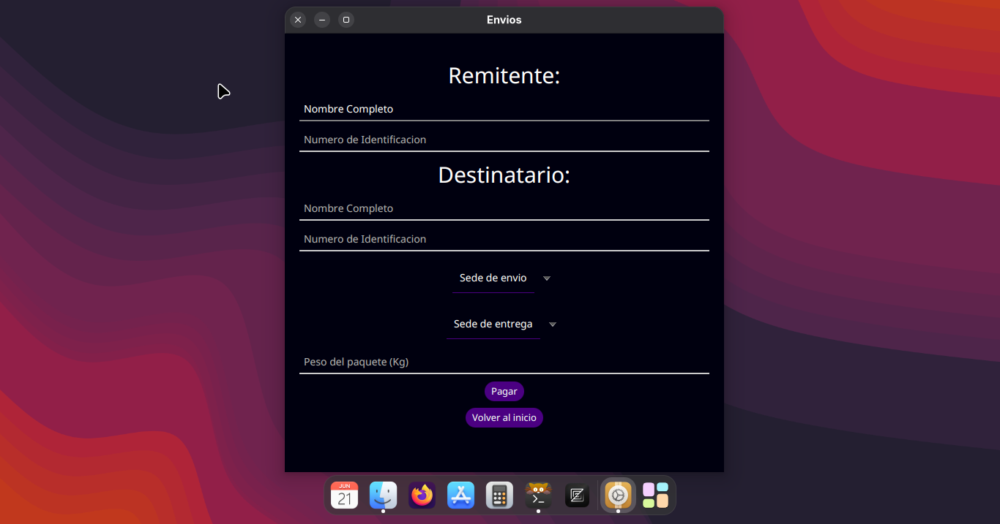
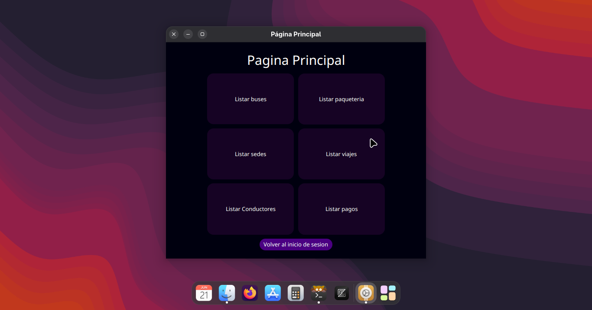

# Prog-Transporte-II
Full Stack Project Deployed on Railway: Transport management desktop platform. Built with Javafx, Spring and powered by MySQL
# Execution Instructions
Execute in client/ or server/ maven javafx or maven spring-boot:
```
mvn javafx:run
mvn spring-boot:run
```
Compile server or client with:
```
mvn clean package
```
Note: The client's `pom.xml` targets Linux only (JavaFX Linux classifier).
# In Action Screenshots




